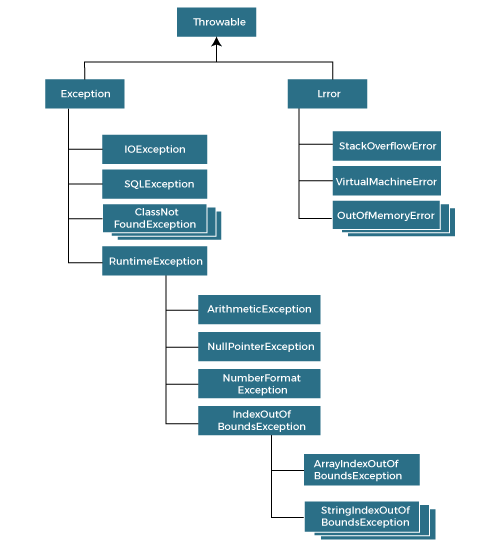

1. **try-with-resources in Java**
   - The try-with-resources statement ensures that the resources (like files, network connections, etc.) are closed automatically after the program is done using them. 
   - It works with any resource that implements the AutoCloseable interface.
     - How it works:
       - When the try-with-resources block completes (whether normally or due to an exception), it automatically calls the close() method on each resource declared in the try block.
         - This feature was introduced in Java 7 and eliminates the need to explicitly close resources like files or streams in the finally block.

                  try (ResourceType resource = new ResourceType()) {
                    // Use the resource
                  } catch (ExceptionType e) {
                    // Handle exception
                  }

            try (BufferedReader br = new BufferedReader(new FileReader("file.txt"))) {
                System.out.println(br.readLine());
            } catch (IOException e) {
                e.printStackTrace();
            }
     - Here, BufferedReader and FileReader are closed automatically at the end of the block, even if an exception occurs.
   - Advantages:
     1. Automatic resource management: No need for explicit closing, which makes the code cleaner and prevents resource leaks.
     2. Simplifies exception handling: The automatic closing of resources works even if exceptions are thrown within the try block.
     - custom implementation : [CustomResourceExample.java](CustomResourceExample.java)
     - Resources Must Implement AutoCloseable or Closeable
     - Resources are Closed in Reverse Order
     - Exception Suppression
   
           try (MyResource resource = new MyResource()) {
              throw new Exception("Primary exception");
           } catch (Exception e) {
              System.out.println("Caught: " + e.getMessage());
              for (Throwable t : e.getSuppressed()) {
                  System.out.println("Suppressed: " + t.getMessage());
              }
           }
     - No null Resources
     - Cannot Reassign Resources

2. **catch with Multiple Exceptions**
   - In Java 7, the ability to catch multiple exceptions in a single catch block was introduced. 
   - This feature is useful when multiple exceptions are handled in the same way. It helps reduce code duplication.
   - How it works: 
        - Multiple exceptions can be caught using a single catch block by separating the exception types with the | (pipe) symbol.
        - The exceptions should not have a parent-child relationship,
          i.e., you can't catch IOException and FileNotFoundException together because FileNotFoundException is a subclass of IOException.
     
               try {
                  // Code that may throw exceptions
               } catch (IOException | SQLException e) {
                  // Handle both IOException and SQLException
                  e.printStackTrace();
               }
   - In this example, both IOException and SQLException are handled by the same catch block.
   - Key points:
     1. The variable e in the catch block is implicitly final, meaning you can't reassign it within the block. 
     2. This feature reduces code duplication when multiple exceptions have the same handling logic.

- In Java, exceptions are broadly categorized into two main types: checked exceptions and unchecked exceptions. Both types derive from the java.lang.Throwable class, which has two primary subclasses: Error and Exception. Below is a comprehensive list of exception types along with their child classes:

  1. Throwable
     - Subclasses:
        Error: Indicates serious problems that a reasonable application should not try to catch.

          Examples:
          StackOverflowError
          OutOfMemoryError
          NoClassDefFoundError
          InternalError
          LinkageError
          UnknownError
  Exception: Represents conditions that a reasonable application might want to catch. It is further divided into two main categories: checked exceptions and unchecked exceptions.

  2. Checked Exceptions
     - These exceptions must be either caught or declared in the method signature. They are checked at compile-time.
       1. IOException: Signals that an I/O exception of some sort has occurred.

               Child Classes:
               FileNotFoundException
               EOFException
               MalformedURLException
               SocketException
               InterruptedIOException
               PrintException
               UnknownHostException
       2. SQLException: Indicates a database access error or other errors.

                Child Classes:
                SQLWarning
                BatchUpdateException
                DataTruncation
                SQLTimeoutException
       3. ClassNotFoundException: Thrown when an application tries to load a class through its string name, but no definition for the class could be found.

       4. InvocationTargetException: Thrown when an invoked method or constructor throws an exception.

       5. NoSuchMethodException: Indicates that a particular method could not be found.

       6. NoSuchFieldException: Indicates that a particular field could not be found.

  3. Unchecked Exceptions
      - These exceptions do not need to be declared or caught. They are derived from RuntimeException.
     
            1. RuntimeException: The superclass of those exceptions that can be thrown during the normal operation of the Java Virtual Machine.
            Child Classes:
            NullPointerException
            IndexOutOfBoundsException
            ArrayIndexOutOfBoundsException
            ArithmeticException
            ClassCastException
            IllegalArgumentException
            IllegalStateException
            UnsupportedOperationException
            ConcurrentModificationException
            NegativeArraySizeException
            SecurityException
            FormatFlagsConversionMismatchException
            RegexTimeoutException

  4. Other Notable Exceptions
       AssertionError: Thrown to indicate that an assertion has failed.
       ExceptionInInitializerError: Thrown when an exception occurs during the evaluation of a static initializer or the initialization of a static variable.
       StackOverflowError: Thrown when a stack overflow occurs due to deep recursion.
 Summary
 This hierarchy illustrates the structure of exceptions in Java. Errors are usually indicative of serious issues that are not recoverable, while Exceptions can often be handled gracefully in applications. Checked exceptions must be dealt with explicitly, while unchecked exceptions are typically runtime issues that could indicate bugs in the program logic.

If you need more specific details or examples for any particular exception, let me know!