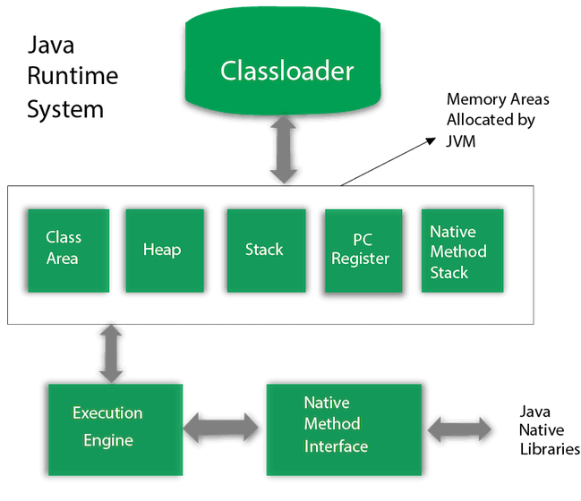

- JVM working and memory :
    
    - ClassLoader
         - ClassLoader is a subsystem of JVM which is used to load class files. Whenever we run the java program, it is loaded first by the classloader. There are three built-in classloaders in Java. 
           1. Bootstrap ClassLoader: This is the first classloader which is the super class of Extension classloader. It loads the rt.jar file which contains all class files of Java Standard Edition like java.lang package classes, java.net package classes, java.util package classes, java.io package classes, java.sql package classes etc.
           2. Extension ClassLoader: This is the child classloader of Bootstrap and parent classloader of System classloader. It loades the jar files located inside $JAVA_HOME/jre/lib/ext directory.
           3. System/Application ClassLoader: This is the child classloader of Extension classloader. It loads the classfiles from classpath. By default, classpath is set to current directory. You can change the classpath using "-cp" or "-classpath" switch. It is also known as Application classloader.
    - **Heap** : 
        - It is the runtime data area in which objects are allocated.
        - objects and their instance variables (non-static fields).
        - Garbage Collection: Objects in the heap are managed by the Garbage Collector (GC). 
                              It reclaims memory from objects that are no longer in use (i.e., those that are unreachable).
        - Structure:
          1. Young Generation: Where new objects are allocated. It is further divided into:
          2. Eden Space: New objects are initially allocated here.
          3. Survivor Spaces (S0, S1): Objects that survive GC in the Eden space are moved to survivor spaces.
          4. Old Generation (Tenured): Long-living objects that survive multiple garbage collection cycles in the young generation are moved here.
          5. Permanent Generation (before JDK 8): This part stored metadata for loaded classes, method data, etc. In JDK 8 and later, this has been replaced by Metaspace.
        - Shared: The method area is shared among all threads in the JVM. Each thread accesses the method area to load class-level information and execute static methods.
        - Location: In JDK 8 and later, the method area has been replaced by the Metaspace.

    - Method Area (part of Heap)(Class area): Stores class-level information, including:
        1. Class structure (metadata, method data, field data)
        2. Static variables
        3. Constant pool
      - When a class is loaded by the JVM:
          - The method area stores:
            1. The bytecode of the class (class methods, static methods, constants, etc.)
            2. Static variables (class variables), which are shared across all instances of the class.
            3. Runtime constant pool (contains symbolic references used by the class).
            4. Unlike instance variables, which are stored in the heap inside the object, static variables are associated with the class itself, not with any specific object.
  
      - **Stack**  : 
          - Java Stack stores frames. It holds local variables and partial results, and plays a part in method invocation and return.
          - Each thread has a private JVM stack, created at the same time as thread.
          - A new frame is created each time a method is invoked. A frame is destroyed when its method invocation completes.
          - Holds local variables and method call information for each thread.
          - Purpose: Each thread has its own stack that stores frames. Each frame corresponds to a method call and contains local variables, method call arguments, and the method's return value.
          -  Contents:
              1. Local variables and references to objects in the heap.
              2. Method call information (e.g., return addresses, intermediate results).
              3. Stack frames for each method invocation.
          - Thread-specific: Each thread gets its own stack, and stack memory is created when the thread is created.
          - Lifecycle: When a method is called, a new frame is pushed onto the stack. When the method completes, the frame is popped.
      - **Program Counter Register** : PC (program counter) register contains the address of the Java virtual machine instruction currently being executed.
      - Native Method Stack
          - It contains all the native methods used in the application.
      - **Execution Engine**
          - It contains:
             1. A virtual processor
             2. Interpreter: Read bytecode stream then execute the instructions.
      - **Just-In-Time(JIT) compiler:** It is used to improve the performance. 
          JIT compiles parts of the byte code that have similar functionality at the same time, 
          and hence reduces the amount of time needed for compilation. Here, the term "compiler" refers to a translator from the instruction 
          set of a Java virtual machine (JVM) to the instruction set of a specific CPU.
      - **Java Native Interface**
           - Java Native Interface (JNI) is a framework which provides an interface to communicate with another application written in another language like C, C++, Assembly etc. 
           - Java uses JNI framework to send output to the Console or interact with OS libraries.
