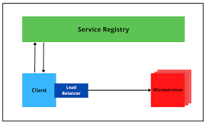

- Spring Cloud provides tools for developers to quickly build some of the common patterns in distributed systems 
- (e.g. configuration management, service discovery, circuit breakers, intelligent routing, micro-proxy, control bus, short lived microservices and contract testing). 
- Coordination of distributed systems leads to boilerplate patterns, and using Spring Cloud developers can quickly stand up services and applications that implement those patterns. 
- They will work well in any distributed environment, including the developer’s own laptop, bare metal data centres, and managed platforms such as Cloud Foundry.

  - Features : Spring Cloud focuses on providing good out of box experience for typical use cases and extensibility mechanism to cover others.
      - Distributed/versioned configuration 
      - Service registration and discovery 
      - Routing 
      - Service-to-service calls 
      - Load balancing 
      - Circuit Breakers 
      - Distributed messaging 
      - Short-lived microservices (tasks)
        - Consumer-driven and producer-driven contract testing

        `

            plugins {
              id 'java'
              id 'org.springframework.boot' version '3.3.0'
              id 'io.spring.dependency-management' version '1.1.4'
            }
            repositories {
              mavenCentral()
            }
        
            ext {
              set('springCloudVersion', "2023.0.2")
            }
        
            dependencyManagement {
              imports {
                  mavenBom "org.springframework.cloud:spring-cloud-dependencies:${springCloudVersion}"
              }
            }`
- spring Cloud config server : 
    - use git, SVN, file system, vault to store config
    - remove the configuration from application and store in centralized store access all environment
    - configuration like microservice app retrieve the configuration from the server startup.
        - app can be notified of changes and process changes in refresh event.
- Service Discovery ;
  - with dynamic nature of any cloud native application, depending on url can be problematic
  - service discovery allows microservices to easily discover the routes to the service it need to use
  - ex. Netflix eureka , Zookeeper, consul
  
    
- Routing and messaging :
    - cloud native application will be composed by many microservice so communication will be critical
    - Spring cloud support communication via HTTP requests or via messaging 
    - Routing and Load Balancing 
        - Netflix ribbon and open feign 
    - Messaging :
        - Rabbit MQ or Kafka
- api gateway : 
    - [api-gateway.md](api-gateway.md)
- Circuit Breaking 
    - Failure is inevitable but your user's don't need to know
    - circuit Breakers can help an application function in the face of failure 
    - Netflix Hystrix
- Tracing :
    - A single request to get data from application may result an exponentially larger number of
    requests to various microservice
    - Tracing this requests through the application is critical when debugging 
    - Spring cloud sleuth and zipkin 
- CI pipeline and Testing 
    - to-do