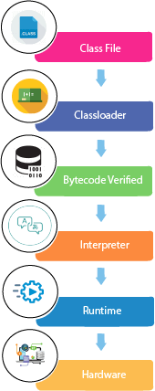

- [jvm-working.md](../jvm-working.md)
1. Object:
     1. Definition: An object is an instance of a class. It represents a real-world entity with attributes (properties) and behaviors (methods).
     2. Characteristics:
         - Each object has its own state (data) and behavior (functions).
         - Objects are created from classes, which serve as blueprints.
2. Class:
     1. Definition: A class is a blueprint for creating objects. It defines the attributes and methods that the created objects will have.
     2. Characteristics:
           - A class encapsulates data for the object and methods to manipulate that data.
           - It serves as a template to create multiple objects with similar properties and behaviors.
3. Inheritance: 
      1. Definition: Inheritance is a mechanism that allows one class to inherit attributes and methods from another class. It promotes code reusability and establishes a hierarchical relationship between classes.
      2. Types:
         - Single Inheritance: A class inherits from one superclass.
         - Multilevel Inheritance: A class inherits from a superclass, which itself is a subclass of another class.
         - Hierarchical Inheritance: Multiple subclasses inherit from a single superclass.
         - runtime polymorphism -> dynamic methode dispatch 
4. Polymorphism:
   1. Definition: Polymorphism allows methods to perform different tasks based on the object that it is acting upon. It means "many shapes" and can be achieved through:
       - Method Overloading: Same method name with different parameters in the same class.
       - Method Overriding: A subclass provides a specific implementation of a method already defined in its superclass.
5. Abstraction:
   1. Definition: Abstraction is the concept of hiding the complex implementation details and showing only the essential features of an object. It can be achieved through:
         - Abstract Classes: A class that cannot be instantiated and may contain abstract methods (without implementation) and concrete methods.
         - Interfaces: A reference type in Java that can contain only constants, method signatures, default methods, static methods, and nested types.
6. Encapsulation:
   1. Definition: Encapsulation is the technique of bundling the data (attributes) and methods (functions) that operate on the data into a single unit, 
      usually a class. It restricts direct access to some of the object's components, 
      which can prevent the accidental modification of data.
         - It is achieved by making class attributes private and 
         - providing public getter and setter methods to access and update those attributes.

