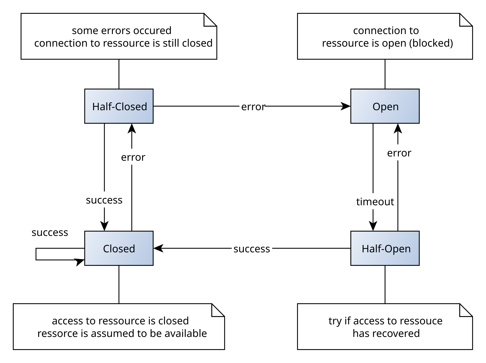

- Circuit Breaker Pattern
- The Circuit Breaker pattern is a design pattern used to protect microservices or distributed systems from cascading failures. 
- It prevents a service from making repeated requests to a failing service by "breaking" the connection and providing fallback behavior. 
- This helps maintain system stability by limiting the impact of failures.

- The Circuit Breaker pattern has three states:
   1. Closed: In this state, the circuit breaker allows requests to pass through to the service.
   2. Open: After a certain number of consecutive failures, the circuit breaker "opens" and blocks any further requests to the failing service. This prevents overwhelming the failing service with additional requests.
   3. Half-Open: After a certain period, the circuit breaker moves to a half-open state to test if the underlying issue is resolved. If the next request succeeds, the circuit returns to the Closed state. If it fails, the circuit returns to the Open state.
- When to Use Circuit Breaker Pattern
   1. When a service depends on an unstable or potentially unreliable external service.
   2. To avoid cascading failures in microservice architectures.
   3. To handle timeouts and transient errors effectively.
- How Circuit Breaker Works
   1. Success: When calls succeed, the circuit breaker remains in the Closed state.
   2. Failure Threshold: If calls start failing (e.g., due to timeouts, exceptions), the circuit breaker counts failures.
   3. Circuit Opens: Once a threshold of failures is reached, the breaker opens and prevents further calls from being made.
   4. Retry: After a certain period, the circuit breaker retries calls to see if the service has recovered.
   5. Fallback: If the service is still down, fallback methods (e.g., cached responses or default values) can be used.
   6. Example in Java using Resilience4j

- Let's implement a Circuit Breaker using Resilience4j, a lightweight library for implementing Circuit Breaker and other resilience patterns in Java.

1. Add Maven Dependency
   First, add the necessary dependencies for Resilience4j in your pom.xml.

         <dependency>
         <groupId>io.github.resilience4j</groupId>
         <artifactId>resilience4j-spring-boot2</artifactId>
         <version>1.7.1</version>
         </dependency>
         <dependency>
         <groupId>io.github.resilience4j</groupId>
         <artifactId>resilience4j-circuitbreaker</artifactId>
         <version>1.7.1</version>
         </dependency>
2. Configure Circuit Breaker
   Next, configure the Circuit Breaker settings in your application.yml or application.properties.

         resilience4j.circuitbreaker:
          instances:
           myService:
               registerHealthIndicator: true
               failureRateThreshold: 50
               waitDurationInOpenState: 5000  # Time in milliseconds
               ringBufferSizeInClosedState: 5
               ringBufferSizeInHalfOpenState: 3
               slidingWindowSize: 10
               minimumNumberOfCalls: 5
               automaticTransitionFromOpenToHalfOpenEnabled: true
      - In this configuration:
         failureRateThreshold: 50: If 50% of the calls fail, the circuit breaker will open.
         waitDurationInOpenState: 5000: The circuit breaker stays open for 5 seconds before transitioning to half-open.
         ringBufferSizeInClosedState: 5: Only consider the last 5 calls to determine if the failure rate is too high.

3. Implement Circuit Breaker Logic in Your Service :
   Now, wrap the service call in a circuit breaker. The method will attempt to call an external service. If the call fails, the circuit breaker will open and fall back to a default response.

         import io.github.resilience4j.circuitbreaker.annotation.CircuitBreaker;
         import org.springframework.stereotype.Service;
         @Service
         public class MyService {
         
             @CircuitBreaker(name = "myService", fallbackMethod = "fallbackResponse")
             public String callExternalService() {
                 // Simulating an external service call (e.g., REST call)
                 if (Math.random() > 0.5) {
                     throw new RuntimeException("Service Failure");
                 }
                 return "External Service Response";
             }
         
             // Fallback method in case of failure
             public String fallbackResponse(Throwable throwable) {
                 return "Fallback Response: Service Unavailable";
             }
         }
   - In this example:
       - The callExternalService method is wrapped with a circuit breaker named "myService".
       - If the call fails or the circuit is open, it falls back to the fallbackResponse method, which returns a default message.
4. Using the Service in a Controller : 
   Now, let's invoke the service method from a REST controller.

         import org.springframework.web.bind.annotation.GetMapping;
         import org.springframework.web.bind.annotation.RestController;
         @RestController
         public class MyController {
             private final MyService myService;
             public MyController(MyService myService) {
                 this.myService = myService;
             }
             @GetMapping("/get-response")
             public String getResponse() {
                 return myService.callExternalService();
             }
         }
5. Circuit Breaker in Action
   1. When the external service is stable, the response will be "External Service Response".
   2. If the service fails more than the defined threshold (e.g., 50%), the circuit breaker opens and future requests receive the fallback response: "Fallback Response: Service Unavailable".
   3. After a period, the circuit moves to the half-open state to check if the service has recovered.
   - Flow of Circuit Breaker:
   1. Initial State (Closed): Service calls flow normally.
   2. Failures Occur: If a number of consecutive failures occur, the circuit breaks.
   3. Open State: Further requests receive fallback responses.
   4. Half-Open State: After a timeout, the circuit tests if the service has recovered.
   5. Recovered or Failure Continues: Depending on the outcome, the circuit either closes or stays open.

                              ┌─────────┐
                              │         │
                              │  Closed │─────────┐
                              │         │         │
                              └────┬────┘         ▼
                                   │           Failure
                                   │      ┌────────────────┐
                                   │      │                │
                                   │      │    Open        │
                  Successful  Calls└─────▶  Circuit        │
              ────────────────┐           │    Breaker     │
                              │           │                │
                              │           └────────────────┘
                              │             ▲
                              ▼             │
                              Half-Open     Timer Expires
                              Circuit
         
       

      - Benefits of the Circuit Breaker Pattern
      1. Improves Resilience: Prevents cascading failures and service overloads.
      2. Fail Fast: Reduces waiting time for users when a service is down by failing fast and returning fallback responses.
      3. Graceful Recovery: Allows services to recover gracefully once the issue is resolved.
- The Circuit Breaker pattern, when combined with retry mechanisms, logging, and monitoring tools, is an effective way to build resilient microservices.

Hystrix is a latency and fault-tolerance library designed to isolate points of access to remote systems, services, or third-party libraries, and stop cascading failures in a microservice architecture. Although Netflix has officially put Hystrix in maintenance mode, it is still widely used for handling service failures, timeouts, and for implementing the Circuit Breaker pattern.

- Circuit Breaker with Hystrix : 
- In Hystrix, the Circuit Breaker monitors failures and prevents calls to a service when the failure threshold is exceeded. 
- It allows for fallback logic when the circuit is open and then periodically checks if the service has recovered.

Steps to Implement Circuit Breaker using Hystrix
1. Add Dependencies
   First, add the necessary Hystrix dependencies in your pom.xml if you're using Maven.

         <dependency>
         <groupId>org.springframework.cloud</groupId>
         <artifactId>spring-cloud-starter-netflix-hystrix</artifactId>
         </dependency>
         <dependency>
         <groupId>org.springframework.cloud</groupId>
         <artifactId>spring-cloud-starter-netflix-hystrix-dashboard</artifactId>
         </dependency>
     - For Spring Boot 2.x, you also need to include spring-cloud-dependencies in your pom.xml.

            <dependencyManagement>
            <dependencies>
            <dependency>
            <groupId>org.springframework.cloud</groupId>
            <artifactId>spring-cloud-dependencies</artifactId>
            <version>Hoxton.SR12</version> <!-- Use the latest stable version -->
            <type>pom</type>
            <scope>import</scope>
            </dependency>
            </dependencies>
            </dependencyManagement>
2. Enable Hystrix in Spring Boot Application : 
   - To enable Hystrix Circuit Breaker, annotate your main Spring Boot application class with @EnableHystrix and @EnableHystrixDashboard 
   - if you want to use the Hystrix dashboard for monitoring.

         import org.springframework.boot.SpringApplication;
         import org.springframework.boot.autoconfigure.SpringBootApplication;
         import org.springframework.cloud.client.circuitbreaker.EnableCircuitBreaker;
         import org.springframework.cloud.netflix.hystrix.EnableHystrix;
         @SpringBootApplication
         @EnableHystrix  // Enable Hystrix Circuit Breaker
         public class HystrixExampleApplication {
             public static void main(String[] args) {
                 SpringApplication.run(HystrixExampleApplication.class, args);
             }
         }
3. Create a Service with Hystrix Circuit Breaker
   - You can now define a service with a circuit breaker. 
   - To wrap a method with Hystrix, use the @HystrixCommand annotation and define a fallback method that will be invoked when the circuit is open or the service call fails.
   
         import com.netflix.hystrix.contrib.javanica.annotation.HystrixCommand;
         import org.springframework.stereotype.Service;
         @Service
         public class MyService {
             // External service call wrapped with Hystrix
             @HystrixCommand(fallbackMethod = "fallbackResponse")
             public String callExternalService() {
                 // Simulate an external service call
                 if (Math.random() > 0.5) {
                     throw new RuntimeException("Service Failure");
                 }
                 return "External Service Response";
             }
             // Fallback method in case of failure
             public String fallbackResponse() {
                 return "Fallback Response: Service Unavailable";
             }
         }
   - @HystrixCommand: This annotation is used to wrap the method in a Hystrix Circuit Breaker.
   - fallbackMethod: This specifies the fallback method to be called when the service fails or the circuit is open.
4. Expose the Service via REST API
   - Next, expose this service in a REST controller so that it can be accessed via HTTP.

         import org.springframework.web.bind.annotation.GetMapping;
         import org.springframework.web.bind.annotation.RestController;
         @RestController
         public class MyController {
         
             private final MyService myService;
         
             public MyController(MyService myService) {
                 this.myService = myService;
             }
         
             @GetMapping("/get-response")
             public String getResponse() {
                 return myService.callExternalService();
             }
         }
5. Hystrix Configuration Options : 
   - Hystrix allows you to configure various parameters like 
     - request timeout, circuit breaker thresholds, etc. You can configure these in application.yml or application.properties.
   
           hystrix:
            command:
             default:
              execution:
               isolation:
                thread:
                  timeoutInMilliseconds: 3000   # Timeout for service calls
           circuitBreaker:
              requestVolumeThreshold: 5         # Minimum number of requests before considering failure rate
              errorThresholdPercentage: 50      # Failure rate threshold (%)
              sleepWindowInMilliseconds: 5000   # Time the circuit stays open before retrying
   - Key Configuration Parameters:
   1. timeoutInMilliseconds: Maximum time before Hystrix considers a service call as failed.
   2. requestVolumeThreshold: Minimum number of requests before the circuit breaker checks the error threshold.
   3. errorThresholdPercentage: Percentage of failed requests to trigger the circuit breaker.
   4. sleepWindowInMilliseconds: How long the circuit breaker remains open before trying to allow requests again.
6. Monitor Using Hystrix Dashboard
   - You can enable the Hystrix Dashboard to monitor the health of the circuit breakers in your application.
   - Step 1: Add the Hystrix dashboard dependency.

         <dependency>
         <groupId>org.springframework.cloud</groupId>
         <artifactId>spring-cloud-starter-netflix-hystrix-dashboard</artifactId>
         </dependency>
   - Step 2: Enable the Hystrix Dashboard in your Spring Boot application.

         import org.springframework.boot.SpringApplication;
         import org.springframework.boot.autoconfigure.SpringBootApplication;
         import org.springframework.cloud.netflix.hystrix.dashboard.EnableHystrixDashboard;
         @SpringBootApplication
         @EnableHystrixDashboard
         public class HystrixDashboardApplication {
             public static void main(String[] args) {
                 SpringApplication.run(HystrixDashboardApplication.class, args);
             }
         }
   - Step 3: Access the dashboard by visiting http://localhost:8080/hystrix and monitoring the endpoint by adding a stream like http://localhost:8080/actuator/hystrix.stream.
- Example Flow
  1. A client makes a request to /get-response.
  2. The MyService.callExternalService() method is executed.
  3. If the external service fails or times out, the circuit breaker kicks in, and the fallback method fallbackResponse() is called.
  4. The circuit breaker monitors the number of failures and, once the failure threshold is exceeded, moves to an Open state.
  5. In the Open state, all requests are automatically routed to the fallback method.
  6. After a period, the circuit breaker enters a Half-Open state, allowing a few requests to check if the external service has recovered.
  7. If the external service starts working again, the circuit moves back to the Closed state.
- Benefits of Using Hystrix Circuit Breaker:
1. Resilience: Isolates service failures and prevents cascading failures in a microservice architecture.
2. Fail Fast: If a service is down or timing out, Hystrix quickly returns a fallback response instead of waiting for long timeouts.
3. Recovery: Once the external service is back up, the circuit breaker resets, allowing normal traffic to flow again.
4. Visibility: Provides real-time monitoring via the Hystrix dashboard to visualize the status of the circuit breakers.
- By using Hystrix, you can improve the fault tolerance and resilience of your microservices, ensuring that failures are isolated and do not bring down the entire system.