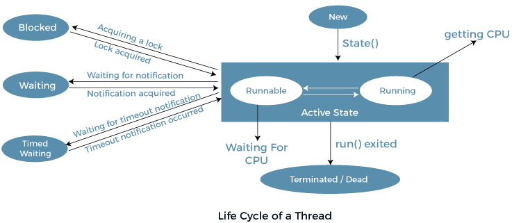

1. New : `public static final Thread.State NEW`
2. Active : `public static final Thread.State RUNNABLE`
3. Blocked / Waiting : `public static final Thread.State BLOCKED` / `public static final Thread.State WAITING`
4. Timed Waiting :   `public static final Thread.State TIMED_WAITING`
    
                sleep
                join with timeout
                wait with timeout
                parkUntil
                parkNanos

5. Terminated : `public static final Thread.State TERMINATED`

- 
    
  1. create thread using runnable 
  2. Create thread using Thread
   
                  public class ThreadWithRunnable()
                  {
                          public static void main(String[] str)
                          {
                              System.out.println(Thread.currentThread());
                              Runnable run1 = () -> System.out.println("Thread 1 running");
                              Thread t1 = new Thread(run1);
                              t1.start();
                              System.out.println(Thread.currentThread());
                    
                              Thread t2 = new Thread(() -> System.out.println("Thread 2 running"));
                              t2.start();
                              System.out.println(Thread.currentThread());
                          }
                  }
- Thread Scheduler in Java : 
    - Thread scheduling is based on priority 0-10 or arrival time of thread 
      1. first come first serve 
      2. Time-slicing scheduling:
      3. Preemptive-Priority Scheduling:

         
  
      4. Preemptive Scheduling: The scheduler can forcibly remove a thread from execution, allowing other threads to run. This ensures that no single thread can monopolize the CPU.
      5. Time-Slicing: Each thread is allocated a time slice or quantum during which it can execute. Once this time slice expires, the scheduler can switch to another thread.
      6. Round Robin: Threads are given equal time slices in a cyclic order. This is a common algorithm for time-sharing systems.
      7. Priority-Based Scheduling: Threads are assigned priorities, and the scheduler selects threads based on their priority levels. Higher-priority threads are more likely to be executed before lower-priority threads.
- we can not start thread twice -> IllegalThreadException will be thrown.
- run() can be call directly, but it will work as normal api
- join() method wait to other thread to complete execution;
- ** Java Thread Pool**
  - Java Thread pool represents a group of worker threads that are waiting for the job and reused many times.
  - In the case of a thread pool, a group of fixed-size threads is created. A thread from the thread pool is pulled out and assigned a job by the service provider. After completion of the job, the thread is contained in the thread pool again.
    - Thread Pool Methods
  
          newFixedThreadPool(int s): The method creates a thread pool of the fixed size s.
        
          newCachedThreadPool(): The method creates a new thread pool that creates the new threads when needed but will still use the previously created thread whenever they are available to use.
        
          newSingleThreadExecutor(): The method creates a new thread.

  - Advantage of Java Thread Pool
    - Better performance It saves time because there is no need to create a new thread.

  - Real time usage
     - It is used in Servlet and JSP where the container creates a thread pool to process the request.
- https://www.javatpoint.com/ShutdownHook-thread
- https://www.javatpoint.com/Garbage-Collection related question

  - In Java, multithreading can be efficiently managed using ExecutorService, Callable, Future, and other thread pool management options. Here’s a breakdown of how these components work together and the other options available for managing multithreading in Java:
    1. ExecutorService : 
       - ExecutorService is part of the java.util.concurrent package and provides a higher-level API for managing threads. 
       - It abstracts the management of threads and allows the execution of tasks concurrently without dealing with Thread objects directly.
           ` ExecutorService executor = Executors.newFixedThreadPool(5); // A pool of 5 threads`
    2. Callable
       - Callable is similar to Runnable, but it can return a result and throw a checked exception. 
         - It is a functional interface with a method call().

                Callable<Integer> task = () -> {
                    // Task logic
                    return 42; // Returning a value
                };
    3. Future
       - Future represents the result of an asynchronous computation. 
       - It provides methods to check if the computation is complete, wait for it to complete, and retrieve the result. 
       - You can also cancel the task if needed.
       - Submitting a Callable Task to ExecutorService:

              Future<Integer> futureResult = executor.submit(task);
       - Getting the result:

             Integer result = futureResult.get(); // This will block until the result is available
       - Checking if the task is done or cancelling it:

                if (futureResult.isDone()) {
                     Integer result = futureResult.get(); // Non-blocking check
                }
              futureResult.cancel(true); // Cancels the task if not started
    4. Using invokeAll() and invokeAny()
       - invokeAll(): Executes a collection of Callable tasks and returns a list of Future objects representing the status of each task.

                List<Callable<Integer>> tasks = Arrays.asList(callableTask1, callableTask2);
                List<Future<Integer>> futures = executor.invokeAll(tasks);
       - invokeAny(): Executes a collection of Callable tasks and returns the result of the first one that completes successfully.
       
                Integer result = executor.invokeAny(tasks);
    5. Other Thread Pool Executors
        - Java provides different types of executors based on your use case:
          1. FixedThreadPool: A pool with a fixed number of threads.
                 `ExecutorService executor = Executors.newFixedThreadPool(10);`
          2. CachedThreadPool: A pool that creates new threads as needed but reuses previously constructed threads when they are available.
                  `ExecutorService executor = Executors.newCachedThreadPool();`
          3. SingleThreadExecutor: A pool with only one thread.
                   `ExecutorService executor = Executors.newSingleThreadExecutor();`
          4. ScheduledThreadPool: A pool that can schedule tasks to run after a delay or periodically.
        
                    ScheduledExecutorService executor = Executors.newScheduledThreadPool(5);
                    executor.schedule(() -> System.out.println("Task executed"), 5, TimeUnit.SECONDS);
    6. CompletableFuture
       - CompletableFuture is an advanced tool introduced in Java 8. It allows you to write non-blocking asynchronous code with a more functional programming style.
         - Example of Asynchronous Execution:

                  CompletableFuture.supplyAsync(() -> {
                  // Perform task
                  return "Task completed";
                  }).thenAccept(result -> {
                  System.out.println(result);
                  });
           - Example Using ExecutorService, Callable, and Future:

                        import java.util.concurrent.*;
                    
                        public class MultithreadingExample {
                        public static void main(String[] args) {
                        // Create a thread pool of 3 threads
                        ExecutorService executor = Executors.newFixedThreadPool(3);
                                // Create a callable task
                                Callable<Integer> callableTask = () -> {
                                    TimeUnit.SECONDS.sleep(2); // Simulate delay
                                    return 42; // Return a result after computation
                                };
                    
                                try {
                                    // Submit task to ExecutorService and receive a Future object
                                    Future<Integer> future = executor.submit(callableTask);
                    
                                    // Do something else while the task is executing...
                    
                                    // Get the result (blocks until the task is completed)
                                    Integer result = future.get();
                                    System.out.println("Result of the callable task: " + result);
                                } catch (InterruptedException | ExecutionException e) {
                                    e.printStackTrace();
                                } finally {
                                    // Always shut down the executor to avoid resource leaks
                                    executor.shutdown();
                                }
                            }
                        }
- Summary:
1. ExecutorService helps manage thread pools efficiently.
2. Callable allows tasks to return results and throw exceptions.
3. Future enables you to retrieve the result of an asynchronous task or cancel it.
4. CompletableFuture adds more powerful functional programming capabilities for handling asynchronous tasks.
5. These tools provide robust and flexible options for multithreading in Java.