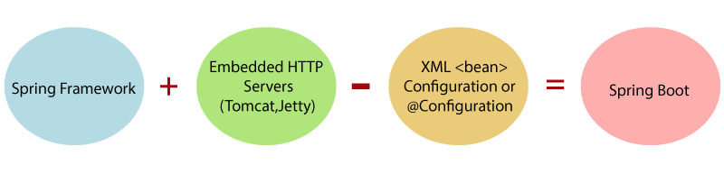

- Spring Boot is a Spring module which provides RAD (Rapid Application Development) feature to Spring framework.
- Spring Boot is an extension of the Spring framework designed to simplify the development of Spring-based applications. 
- It provides a convention-over-configuration approach, 
- eliminating the need for much of the manual setup required in traditional Spring applications.
- can create application with very minimal or zero configuration

- Why Spring Boot?
  1. Convention over Configuration: Spring Boot autoconfigures many aspects of the application based on the dependencies in the classpath.
  2. Standalone Applications: Provides embedded servers (like Tomcat, Jetty) for building standalone applications.
  3. Reduced Complexity: Spring Boot reduces the complexity by offering ready-to-use configurations, starter templates, and sensible defaults.
  4. Faster Development: Less boilerplate code, fewer configurations, and ease of dependency management.

- Dependency resolution:
  1. Automatic Version Management: Spring Boot manages the versions of libraries automatically through its dependency management system.
  2. Spring Boot Starters: Simplifies dependency declaration by bundling commonly used dependencies in a single starter (e.g., spring-boot-starter-web).
  3. Transitive Dependency Handling: Automatically pulls in required transitive dependencies.
  4. Exclusions: Allows exclusion of unwanted transitive dependencies to resolve version conflicts or customization.
  5. Profiles: Dependency configurations can be modified per profile (e.g., different dependencies for dev vs. prod environments).
  - Minimal configuration:
    - Spring Boot is designed to offer a "convention over configuration" approach, 
      meaning that most of the required configurations are done automatically, 
      allowing you to start developing with minimal setup. 
    - The framework provides sensible defaults, autoconfigures necessary components, 
      and requires very little manual configuration to get an application up and running.
    - A Spring Boot application requires a minimal structure, often consisting of:
        
            ├── src
            │   ├── main
            │   │   ├── java
            │   │   │   └── com.example.demo
            │   │   │       └── DemoApplication.java
            │   │   ├── resources
            │   │   │   └── application.properties
            │   └── test
            │       ├── java
- Minimal build.gradle for Gradle
   [build.gradle](../../../../build.gradle)

- Minimum configuration 
  - Spring Boot, "minimum configuration" or "zero configuration" refers to the 
    1. framework's ability to automatically configure itself based on the libraries and classes present on the classpath, 
       reducing the need for manual setup. 
    2. This feature is a key part of Spring Boot's design philosophy, enabling developers to quickly create Spring applications with minimal effort.
    - Auto-Configuration: 
       1. Spring Boot comes with a set of predefined configurations that it applies automatically based on the libraries available in your project.
       2. For example, if you include spring-boot-starter-web, Spring Boot automatically sets up the necessary components for a web application, 
          including an embedded Tomcat server, Spring MVC, and default configurations.
    - Convention Over Configuration: 
      1. Spring Boot follows the principle of "convention over configuration," 
          meaning it provides sensible defaults for many configurations. 
      2. This allows developers to override only the settings that are necessary for their specific application.

- Zero Configuration
  1. Embedded Server: By default, Spring Boot applications can run as standalone applications with an embedded server (like Tomcat, Jetty, or Undertow) without needing to deploy to an external server. T
     This significantly reduces setup time and complexity. 
  2. Property Defaults: Many properties are preconfigured, allowing developers to get started quickly without having to define every configuration option. 
     For instance, the default database configuration will work out of the box if you use an embedded database like H2.
  3. Spring Boot Starters: The use of "starters" simplifies dependency management by grouping commonly used libraries together. 
     Including a starter in your pom.xml or build.gradle automatically pulls in the necessary dependencies, reducing manual configuration.
- example : The @SpringBootApplication annotation enables autoconfiguration, component scanning, and configuration properties, 
     allowing you to create a fully functional Spring Boot application with minimal setup.

- Embedded servers for testing: (tomcat/jetty or another server not required)
  - sprint boot provide internal embedded server to run spring boot server 
   
- Bean auto scan: In Spring Framework, bean auto-scanning is a feature that allows Spring to automatically discover and register beans (components, services, repositories, etc.) in the application context based on specified packages. 
  This significantly reduces the need for explicit bean registration in configuration files.
  - How Bean Auto-Scanning Works
    1. Component Scanning: Spring scans the specified packages for classes annotated with stereotype annotations, such as:
    2. @Component: Indicates a generic Spring-managed component. 
    3. @Service: Indicates a service component. 
    4. @Repository: Indicates a data access component. 
    5. @Controller: Indicates a web controller in MVC applications.
  - Configuration: Bean auto-scanning is typically configured in the main application class or through configuration files. 
    In Spring Boot, the @SpringBootApplication annotation enables component scanning for the package in which it is declared and all its sub-packages by default.
  - SpringBootApplication (@Configuration, @EnableAutoConfiguration, @ComponentScan)
    1. @Configuration: Indicates that the class can be used as a source of bean definitions.
    2. @EnableAutoConfiguration: Enables Spring Boot’s autoconfiguration feature.
    3. @ComponentScan: Enables component scanning, looking for beans in the specified package.

- Health matrix:
  - the health matrix refers to a part of the Actuator module that provides health information about the application. 
  - It allows you to monitor the status of various components in your application, 
    such as databases, message queues, and external services, through a unified endpoint. 
  - This is particularly useful for production applications, enabling you to ensure that your application is running smoothly and that its dependencies are healthy.
  - Key Features of Health Matrix
    1. Health Indicators: Spring Boot Actuator comes with several built-in health indicators that check the status of common services (e.g., databases, caches, messaging systems).
       You can also create custom health indicators to monitor specific components in your application. 
    2. Health Status: The health matrix provides a summary status of your application, which can be UP, DOWN, OUT_OF_SERVICE, or UNKNOWN, 
       depending on the health checks of the individual components. 
    3. Health Endpoint: The health information is typically exposed through an HTTP endpoint (e.g., /actuator/health), 
       which can be accessed to retrieve the current health status of the application.
  - How to Set Up Health Matrix in Spring Boot
    1. Add Dependencies : `implementation 'org.springframework.boot:spring-boot-starter-actuator'`
    2. Configure Application Properties : 
       [application.properties](../application.properties)
    3. http://localhost:8080/actuator/health
      - Built-in Indicators: Spring Boot provides a variety of built-in health indicators to monitor common services.
      - Custom Indicators: You can create custom health indicators to monitor your application's specific components.
      - Unified Endpoint: The /actuator/health endpoint gives you a consolidated view of the application's health status, making it easier to monitor your application in production.
    - Actuator provide 14 endpoint default, we can customize each end point, or we can create new endpoint 
    - Use @Component @EndPoint id = "end point id", enableByDefault or use proprieties file

- [SpringBootDemoApplication.md](../../SpringBootDemoApplication.md)
- [springboot-version.md](springboot-version.md)
