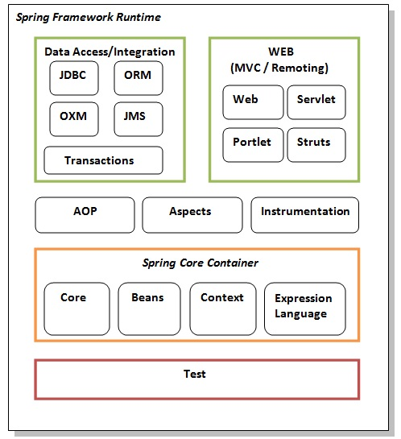

- Spring is a comprehensive framework for building Java applications.
- it is build top of java EE
- It's known for providing infrastructure support for developing Java applications,
  making it easier to develop enterprise applications by offering
  a set of abstractions and tools for handling dependency injection, transaction management,
  and various other enterprise-level concerns.

- Key Features of Spring:
    1. Dependency Injection (DI): Dependency Injection (DI) is a design pattern used in software development to implement Inversion of Control (IoC).
       - allow object to be injected rather than hardcoding 
       - Type:
          1. Constructor Injection : Dependencies are provided through a class constructor.
          2. Setter Injection : Dependencies are injected using public setter methods.
          3. Field Injection : Dependencies are directly injected into the fields using annotations (e.g., @Autowired in Spring).
       - Advantages of Dependency Injection
          1. Loose Coupling: Components are loosely coupled, making the system easier to maintain and extend.
          2. Testability: Dependencies can be mocked or stubbed for unit testing.
          3. Code Reusability: Services can be reused across different modules.
    2. Aspect-Oriented Programming (AOP):
       - Helps in modularizing cross-cutting concerns like logging, security, and transaction management.
    3. Data Access: Simplifies working with databases using the Spring JDBC module and ORM integrations (Hibernate, JPA).
    4. Transaction Management: Offers declarative transaction management for various resources.
    5. MVC Framework: Provides a web application framework for building web applications.
    6. Security: Through Spring Security, it provides authentication, authorization, and other security-related features.

- Spring Modules
  

    1. Test: This layer provides support of testing with JUnit and TestNG.
    2. Spring Core Container : The Spring Core container contains core, beans, context and expression language (EL) modules.
        - Core and Beans: These modules provide IOC and Dependency Injection features.
        - Context: This module supports internationalization (I18N), EJB, JMS, Basic Remoting.
        - Expression Language: It is an extension to the EL defined in JSP.
          It provides support to setting and getting property values, method invocation, accessing collections and indexers,
          named variables, logical and arithmetic operators, retrieval of objects by name etc.
    3. AOP, Aspects and Instrumentation:
        - These modules support aspect oriented programming implementation where you can use Advices, Pointcuts etc. to decouple the code.
        - The aspects module provides support to integration with AspectJ.
        - The instrumentation module provides support to class instrumentation and classloader implementations.
    4. Data Access / Integration:
        - This group consist of JDBC, ORM, OXM, JMS and Transaction modules. These modules basically provide support to interact with the database.
    5. This group consist of Web, Web-Servlet, Web-Struts and Web-Portlet. These modules provide support to create web application.

     