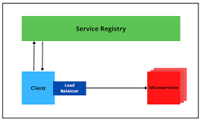

- Spring Cloud provides tools for developers to quickly build some of the common patterns in distributed systems 
- (e.g. configuration management, service discovery, circuit breakers, intelligent routing, micro-proxy, control bus, short lived microservices and contract testing). 
- Coordination of distributed systems leads to boilerplate patterns, and using Spring Cloud developers can quickly stand up services and applications that implement those patterns. 
- They will work well in any distributed environment, including the developer’s own laptop, bare metal data centres, and managed platforms such as Cloud Foundry.

  - Features : Spring Cloud focuses on providing good out of box experience for typical use cases and extensibility mechanism to cover others.
      - Distributed/versioned configuration 
      - Service registration and discovery 
      - Routing 
      - Service-to-service calls 
      - Load balancing 
      - Circuit Breakers 
      - Distributed messaging 
      - Short-lived microservices (tasks)
        - Consumer-driven and producer-driven contract testing

        `

            plugins {
              id 'java'
              id 'org.springframework.boot' version '3.3.0'
              id 'io.spring.dependency-management' version '1.1.4'
            }
            repositories {
              mavenCentral()
            }
        
            ext {
              set('springCloudVersion', "2023.0.2")
            }
        
            dependencyManagement {
              imports {
                  mavenBom "org.springframework.cloud:spring-cloud-dependencies:${springCloudVersion}"
              }
            }`
- spring Cloud config server : 
     - Spring Cloud Config Server provides centralized configuration management for microservices 
     - use git, SVN, file system, vault to store config
     - remove the configuration from application and store in centralized store access all environment
     - The configuration is fetched and served to client applications (microservices) at startup and during runtime using refresh events, 
        - so services are always updated with the latest configuration without manual restarts.
        1. Git/SVN/File System:
           - These stores allow you to manage and version your configuration files (YAML, properties).
           - Configuration properties are externalized from the microservices into the centralized config server.
           - At startup, the microservices retrieve their configuration from the Spring Cloud Config Server.
           - The server pulls from the Git/SVN/File system to serve the correct configuration based on the active profiles (dev, test, prod) or labels (e.g., branches in Git).
           - If you modify the configuration in Git/SVN, the changes can be picked up by microservices using Spring’s Refresh Scope and /refresh endpoint, which forces a dynamic reload of the configuration without restarting the application.
        2. HashiCorp Vault:
           - Vault provides a secure way to store and access sensitive configurations, such as API keys and database passwords.
           - Spring Cloud Config integrates with Vault to retrieve secure properties, making it especially useful for secrets management.
           - Configurations stored in Vault are encrypted and decrypted only when accessed.
           - The client (microservice) retrieves sensitive data during startup or refresh.
           - Vault's dynamic secrets allow short-lived credentials for resources like databases.
- Service Discovery ;
  - Service discovery is crucial for cloud-native applications, where services often change dynamically due to scaling, failovers, or updates.
  - Service discovery ensures that microservices can locate other services dynamically and consistently.
  - ex. Netflix eureka , Zookeeper, consul
  - Dynamic Nature of Cloud-Native Applications:
    1. In cloud environments like Google Kubernetes Engine (GKE), services are not static.
    2. Pods and containers are constantly being created and destroyed, and their IPs may change frequently. As a result, hardcoding URLs or IPs for services isn't reliable.
    3. Service discovery helps manage this dynamic environment by providing an abstraction over the changing network details.
  - How Service Discovery Works:
    1. Service discovery systems maintain a registry of service instances and allow microservices to dynamically discover the services they need to connect with. 
    2. It has two components:
       - Service Registration: Services register themselves with a service registry (e.g., Eureka, Consul, Zookeeper) when they start, providing details like IP address, port, and service name.
       - Service Resolution: When a service wants to communicate with another service, it queries the registry to obtain the connection details of the target service.
  - Types of Service Discovery:
    1. Client-Side Service Discovery: Here, the client is responsible for querying the service registry and choosing a healthy instance of the service. This approach is used in systems like Netflix Eureka.
    2. Server-Side Service Discovery: A load balancer acts as an intermediary, querying the service registry on behalf of the client and routing the request to a service instance. Examples include using Consul with HAProxy or Kubernetes DNS.
  - Examples of Service Discovery Tools:
    1. Netflix Eureka: 
        - A client-side service discovery solution. Eureka clients register themselves with a Eureka server, and other microservices query the Eureka server to get service instance details.
        - Clients implement load-balancing by selecting which instance to communicate with.
    2. Apache Zookeeper:
        - Zookeeper is primarily used for distributed coordination and can also be used for service discovery. Services register with Zookeeper, which maintains information about the service instances and allows other services to query for active instances.
    3. HashiCorp Consul:
       - Consul provides service discovery and health checking out of the box. Services register themselves with Consul, and other services query Consul to get the service location.

    

- Routing and messaging :
    - cloud native application will be composed by many microservice so communication will be critical
    - Spring cloud support communication via HTTP requests or via messaging 
    - Routing and Load Balancing 
        - Netflix ribbon and open feign 
    - Messaging :
        - Rabbit MQ or Kafka
- api gateway : 
    - [api-gateway.md](../../microservice/api-gateway.md)
- Circuit Breaking 
    - Failure is inevitable but your user's don't need to know
    - circuit Breakers can help an application function in the face of failure 
    - Netflix Hystrix
    - [circuit-breaker-pattern.md](../../microservice/circuit-breaker-pattern.md)
- Tracing :
    - A single request to get data from application may result an exponentially larger number of
    requests to various microservice
    - Tracing this requests through the application is critical when debugging 
    - Spring cloud sleuth and zipkin 
- CI pipeline and Testing 
    - [CD-CI-pipeline.md](../../cd/ci/CD-CI-pipeline.md)